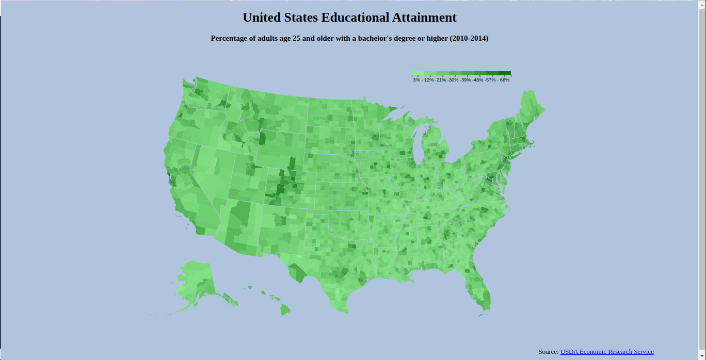

# LIBERCOSOFT PORTFOLIO

> A Choropleth map showing the percentage of adults over 25 years of age with a bachelor's degree or higher
- If you like it please give it a Star⭐️, also you can follow:wink:
> 

## Built With

- HTML
- CSS
- D3.JS

## Live Demo (if available)

- <https://libercosoft.github.io/choropleth-map/>

## Getting Started

To get a local copy up and running follow these simple example steps.

### Prerequisites

- Have a Desktop or Laptop computer running on with Windows, Mac OS or Linux operating system.
- Have a browser install on the computer

### Setup

- If it suits you, on your local computer, create a directory in your preferred location (e.g in the Desktop or Document directory)

### Install

- Open your Terminal/Powershell or any command line interface you use, then navigate to your created abover directory or the directory you'll like to clone this project directory
- Type `https://github.com/LIBERCOSOFT/choropleth-map.git` if your're using https with git or `git@github.com:LIBERCOSOFT/choropleth-map.git` if your preferred is ssh and hit enter
- Navigate to the `choropleth-map` directory on your local computer in your above chosen directory and open the `index.html` file

### View

- You can view the HTML document in your preferred or default browser.

## Author

👤 **Kolapo Precious Akinrinlola**

- GitHub: [@LIBERCOSOFT](https://github.com/LIBERCOSOFT)
- Twitter: [@Gerfieldt](https://twitter.com/Gerfieldt)
- LinkedIn: [Kolapo Akinrinlola](https://linkedin.com/in/kolapo-akinrinlola-072097110)

## 🤝 Contributing

Contributions, issues, and feature requests are welcome!

## Show your support

Give a ⭐️ if you like this project!
